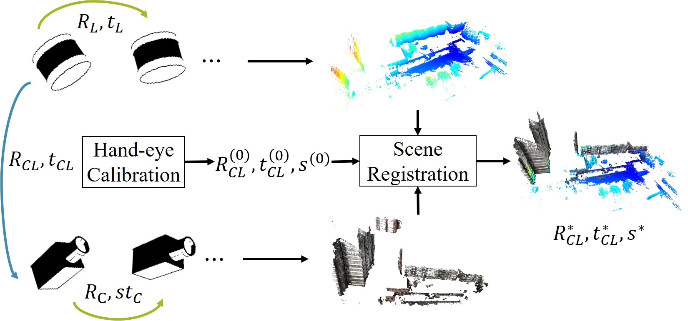
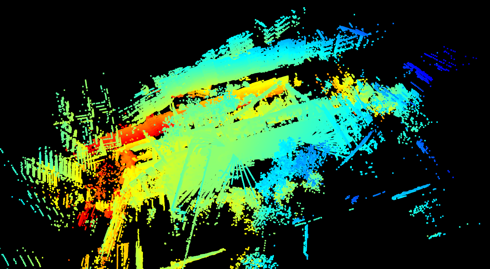
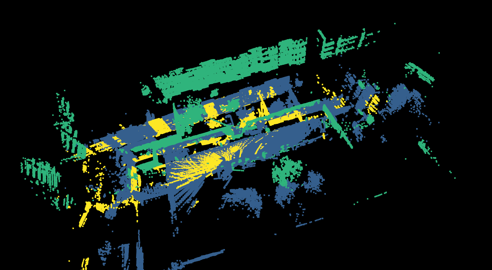
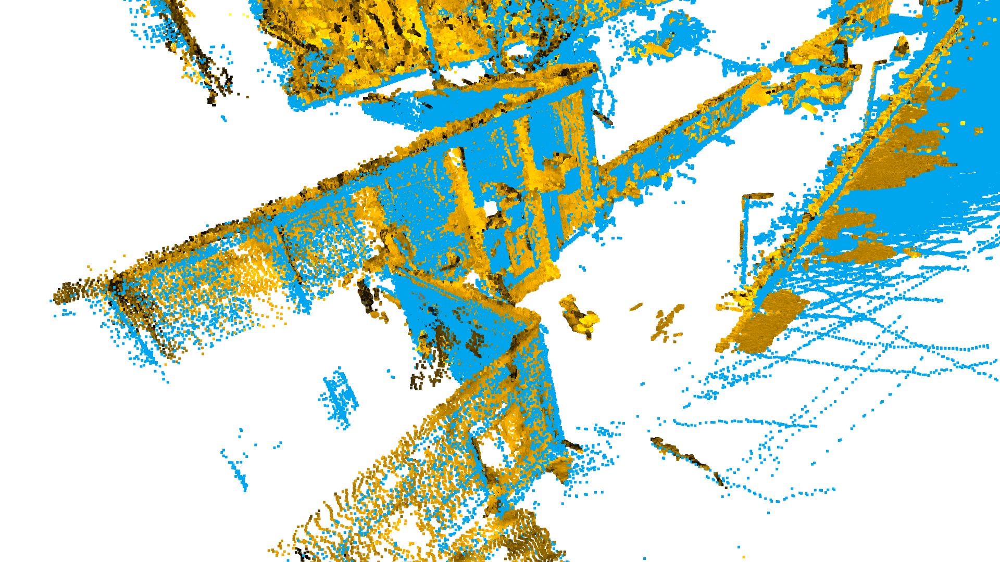
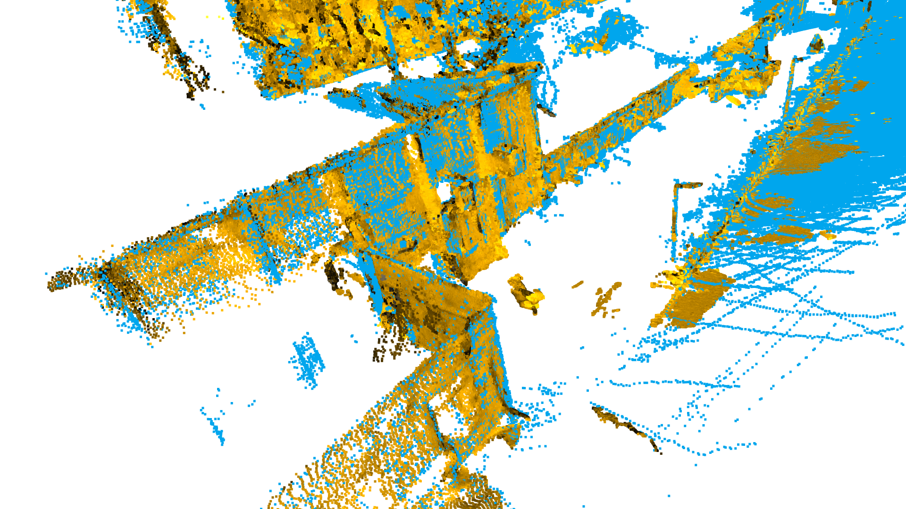

# Targetless LiDAR camera calibration
## Official Implementation of the paper "Targetless Extrinsic Calibration of Camera and Low-resolution 3D LiDAR". 




* Paper: [[IEEE Early Access](https://ieeexplore.ieee.org/document/10097551)]|[[TechRxiv](https://doi.org/10.36227/techrxiv.22155149)]
* All advices, citations, support will be acknowledged and appreciated.
* Feel free to propose any issues you met.
* Thanks for citing our work if you use this code.

# Environment
* Ubuntu 18.04/20.04 or Windows 10
* Python 3.8 or later
* g++ 7 or later
* cmake 3.1.0 or later

# Dependence
* [OpenMVG](https://github.com/openMVG/openMVG)
* [OpenMVS](https://github.com/cdcseacave/openMVS)
* [MinkowskiEngine](https://github.com/NVIDIA/MinkowskiEngine#installation)
* [Open3D](https://github.com/isl-org/Open3D) (pip install open3d)
* [Sklearn](https://scikit-learn.org/stable/) (pip install scikit-learn)

We are truely grateful to the authros of above open-sourced libraries.

# Step 1: Prepare Image and LiDAR data

You need to add sychronized image and LiDAR data to the respective directories `./data/img` and `./data/pcd` first.
```bash
mkdir data && cd data
mkdir img
mkdir pcd
```

Use our cpp tools to preprocess LiDAR data and save to `./data/proc_pcd`. (Remove the backward 180 degrees of each LiDAR scan)

```bash
cd cpp
mkdir build && cd build
cmake ..
make
./preprocess ../../data/pcd ../../data/proc_pcd
```
This preprocess pipeline is accelearted by OpenMP. When it finishes, you can use `./view xxx.cpd` to verify whether the pcd has been correctly filtered.

# Step 2: Estimate image poses using OpenMVG

Please ensure your OpenMVG has been installed propoerly before this step. SequentialSfM engine is suitable for this task empircally. Run `path/to/OpenMVG/build/software/SfM/SfM_SequentialPipeline.py` with input args `input_dir` and `output_dir`. After you finished this step, the resultant `sfm_data.json` can be found in `path/to/output_dir/reconstruction_sequential/`.

<details>
 <summary> If you are a beginner of OpenMVG or need troubleshooting</summary>
 
 If you are a beginner of OpenMVG, please follow our intructions to use the [doc/SfM_SequentialPipeline.py](doc/SfM_SequentialPipeline.py) file to implement SfM.
 
 To use it, you need to follow some simple steps:
 * replace all `path/to/OpenMVG` strings in the script with your specific OpenMVG installation directory.
 * give the intrinsic parameters of your camera. You may put it into an ASCII-coded file or just modify the `intrinsic` variable in the above python script. Fortunately, coarse instrinsic paramters are also OK, as SfM will estimate them simultaneously.
 * run the command `python Sfm_SequentialPipeline.py input_dir output_dir ins_file`. The `input_dir` is the directory containing all your raw images while the `output_dir` is the directory you designate to store all resultant files of OpenMVG. Note that if you choose to modify the `intrinsic` variable in the last step. Please just leave out the third argument `ins_file`.
 * After it finishes running, you will find a `sfm_data.json` file in `path/to/output_dir/reconstruction_sequential/`.
 
</details>

# Step 3: Estimate initial LiDAR poses with RANSAC (RANReg mentioned in our paper)

Please ensure your Open3D has been installed properly in your python environment before this step.
```bash
python multiway_reg.py --basedir xxx --res_dir xxx --input_dr data/proc_pcd 
```
After that, you will see `ranreg_raw.json` in `res_dir/basedir`, which is a Open3D PoseGraph with initial estimated LiDAR poses.

The above command will implement Multiway Registration using RANSAC. Here are some explanations to main args:
* basedir: basic name of resultant directories, just name it as you wish
* res_dir: resultant directory containing a Open3D PoseGraph
* input_dir: directory containing all the preprocessed pcd files

Please wait a few minutes. This process is the most time-consuming part in our framework.
<details>
 <summary> Modification on other args</summary>
 
 * step: use 1 pcd file among every `step` files. Please change this argument carfully, as the pcd poses should keep consistent with the numebr of camera poses.
 * pose_graph: the name of the resultant PoseGraph. If you change this arg, please keep it constant in the following steps.
 * voxel_size: the downsampling voxel size. Smaller size leads to better registration performance as a pay for efficiency.
 * radius: radius to compute information matrix. A larger radius will consider a larger range of points into surface alignment.
 * ne_method: we implement normal estimation different from Open3D. `o3d` indicates using the original Open3D Normal Estimation, but it performs worse in low-resolution laser scans.
 
</details>

# Step 4: Cluster Extraction and Integration (CEI)
1. To start with, use RANSAC hand-eye calibration to extract inlier LiDAR poses:
```bash
python TL_solve_ransac.py --camera_json /path/to/sfm_data.json --pcd_json /path/to/ranreg_raw.json
```
This process (Cluster Extraction) will genrate inlier LiDAR poses to `res/work_dir/clique_ranreg.json`. The `work_dir` parameter is manually set in [TL_solve_ransac.py](TL_solve_ransac.py). To vividly show this process, we display two pictures below. For principles, please see Section IV A-B in our paper.

|Raw graph (ranreg_raw.json)| Clique Extraction (clique_ranreg.json)|
|---|---|
|||

2. Now the raw graph have been splited into several inlier subgraphs. At the next stage, we refine each subgraph with Multiway Registration:
```bash
python clique_split_refine.py --input_dir data/proc_pcd --clique_file /path/to/clique_ranreg.json --init_pose_graph ranreg_raw.json
```
Keep the `basedir` varibale in [clique_split_refine.py](clique_split_refine.py) the same with `work_dir` variable in [TL_solve_ransac.py](TL_solve_ransac.py) to avoid possible issues. You will get `clique_desc_ranreg.json` and a `clique_ranreg` folder after this command. Do not move the folder. It must be placed in the same directory of `clique_desc_ranreg.json`.

3. Now each subgraph has been refined, we need to integrate them together. Please ensure your MinkowskiEngine has been properly installed before this step.

Downlaod [FCGF model](https://node1.chrischoy.org/data/publications/fcgf/KITTI-v0.3-ResUNetBN2C-conv1-5-nout32.pth) and put it to [./FCGF](FCGF) dir. Rename it to `kitti_v0.3.pth`.

```bash
python clique_merge_refine.py --input_dir data/proc_pcd --clique_desc clique_desc_ranreg.json --feat_method FCGF
```
This process (Clique Integration) consolidate each subgraph into one. Don't forget to ensure the `basedir` and `method` variables be same with the above files. The resultant figure is:


Meanwhile, you will get `ranreg_union.json`. Use [reconstruction.py](reconstruction.py) to view it in Open3D Viewer and generate `ranreg_union.pcd`, the merged point cloud from inlier laser scans. 

```bash
python reconstruction.py --input_dir data/proc_pcd --pose_graph ranreg_union.json --clique_file res/work_dir/clique_ranreg.json
```

# Step 5: Hand-eye calibration

Conduct hand-eye calibration among inliers using [TL_solve.py](TL_solve.py).
```bash
python TL_solve.py --camera_json /path/to/sfm_data.json --pcd_json /path/to/ranreg_union.json --save_sol res/work_dir/ranreg_sol.npz
```
This process generates the calibration results with the input of inlier cmaera and lidar poses in `ranreg_sol.npz`
NB: use `--gt_TCL_file` if you have a ground-truth extrinsic matrix, or just omit it and the output evaluation.

# Step 6: Scene registration

Please ensure your OpenMVS has been properly installed and `undistorted_images` and `scene.mvs` has been generated in `path/to/output_dir/reconstruction_sequential/.` dir during your Step 2. 
1. Densify Point Cloud
```bash
cd OpenMVS_build/build/bin
./DensifyPointCloud /path/to/scene.mvs -w /path/to/work_dir/open_mvs/
```
This process densifies the reconstruction of SfM and generate a dense color point cloud using undistored images.

After it finished, you should see `scene_dense.ply` and `scene_dense.mvs` in `path/to/reconstruction_sequential/`. You can also use `./Viewer /path/to/scene_dense.mvs` to check it.

2. Scene Registration
```bash
python Reg7D.py --camera_pcd /path/to/scene_dense.ply --lidar_pcd /path/to/ranreg_union.pcd --TL_init /path/to/TL_ranreg_sol.npz
```
The [Reg7D.py](Reg7D.py) script aligns the camera reconstruction to the lidar one using the intial sim3 transformation solved from Step 5. You will get `ranreg_tcl.txt`, which is the final result of our method. The comparison before and after Scene Registration is shown below:
|Before|After|
|---|---|
|||
